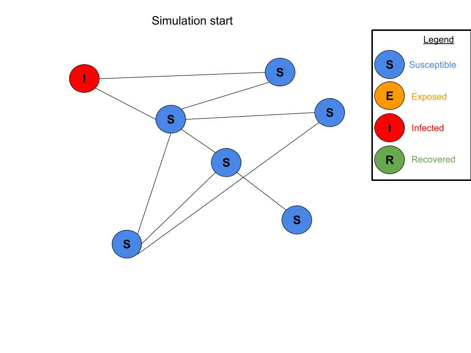

# SEIR model on a graph

**This is not an officially supported Google product.**

This repository contains code to simulate the
[Susceptible-Exposed-Infected-Recovered](https://en.wikipedia.org/wiki/Compartmental_models_in_epidemiology#The_SIR_model)
epidemiologic model on a graph.

The main function to run for a simulation is `seir.simulation`.

This code accompanies a paper:
[Modeling COVID-19 on a network: super-spreaders, testing and containment](https://drive.google.com/file/d/1VMVom32Ba4CbhTYywR7CJi2FMkn04-N0/view?usp=sharing).

For a well implemented and well documented python module of SEIR on a graph,
consider [seirsplus](https://github.com/ryansmcgee/seirsplus)

